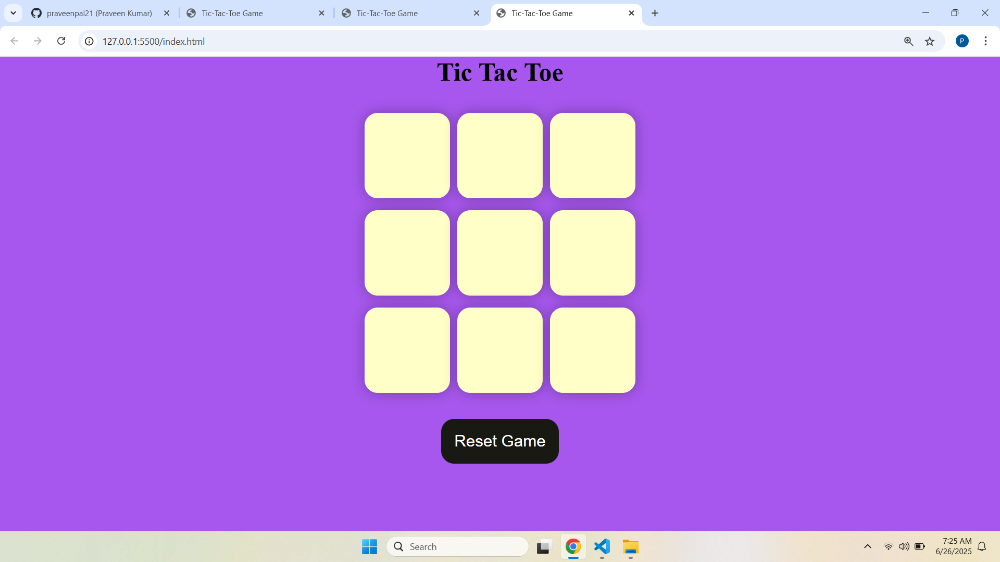

## 📁 Project Structure

```bash
tic-tac-toe/
├── index.html       # Main structure of the web page
├── style.css        # Styling and layout
└── app.js           # Game logic and interactivity

```

## 🖼️ Preview



## ✨ Features

✅ Turn-based gameplay: X and O alternate turns

🎉 Detects win conditions across rows, columns, and diagonals

❓ Identifies draw if all cells are filled with no winner

↺ Reset and New Game options

📊 Real-time UI updates

🌈 Responsive and colorful design

## 📚 How to Play

Open the game in a web browser.

Player O starts first.

Click on any empty box to make a move.

The game automatically detects a win or a draw.

Click "New Game" or "Reset Game" to play again.


## 📝 Technologies Used

HTML5 for structure

CSS3 for styling and layout

JavaScript (Vanilla) for game logic

## 📊 Game Logic Overview

The game board is a 3x3 grid made of buttons.

Each button can be clicked only once.

Game alternates between X and O.

Win conditions are checked after each move.

The winner or draw message is displayed using the DOM.

## 📄 To-Do (Future Enhancements)


#👍 Contributing

Contributions are welcome! If you'd like to improve this project, feel free to fork the repository and submit a pull request.


